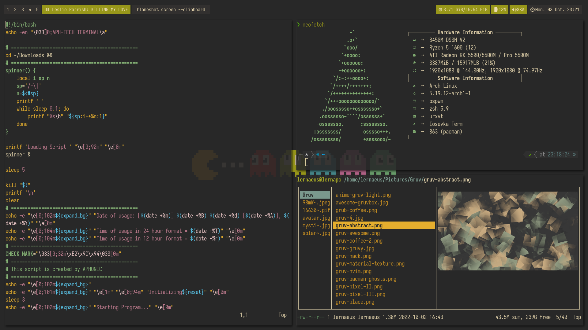

Most of these are copied from [here](https://github.com/khyrthy/dotfiles), with some personal spin-ups

### Preview

## System Information
- Distro: Arch Linux
- Window Manager: BSPWM
- Termianl: URxvt
- File browser: Ranger
- System Information: Neofetch [themed](https://github.com/chick2d/neofetch-themes/)
- Clock: Peaclock

### Theme
Main theme and color schemes of the dotfiles is based on [Gruvbox](https://github.com/morhetz/gruvbox)

### Wallpapers
In the preview I used wallpapers from FrenzyExists' [collection](https://github.com/FrenzyExists/wallpapers)

### Additional information:
- Theme: Iosevka Term/Iosevka Nerd Font/Iosevka SS05 Extended
- [Make your Arch install look actually decent fonts-wise](https://gist.github.com/YoEight/d19112db56cd8f93835bf2d009d617f7)