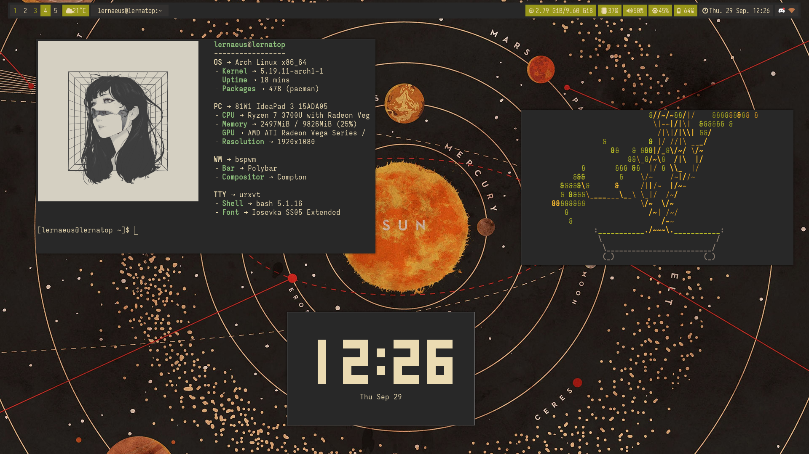

Most of these are copied from [here](https://github.com/khyrthy/dotfiles), with some personal spin-ups

### Preview

## System Information
- Distro: Arch Linux
- Window Manager: BSPWM
- Termianl: URxvt
- System Information: Neofetch with [Talljoe's Fetch](https://github.com/chick2d/neofetch-themes/blob/main/normal/talljoe.conf)
- Clock: Peaclock

### Theme
Main theme and color schemes of the dotfiles is based on [Gruvbox](https://github.com/morhetz/gruvbox)
